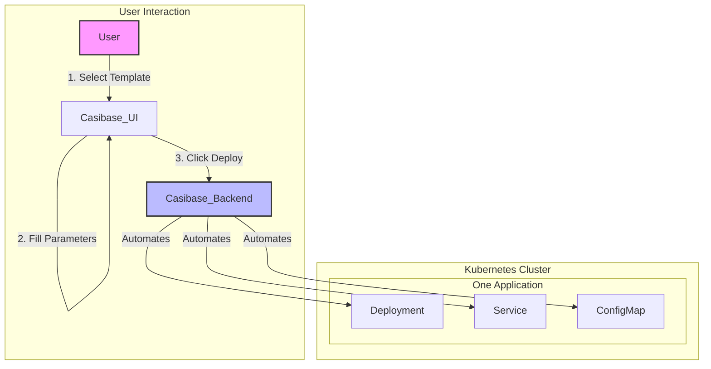

Casibase is an open-source **Container Cloud Platform** built on the foundations of **Docker** and **Kubernetes**. It is designed for individuals and organizations to easily build, manage, and operate their own private cloud environments with a focus on simplicity and application-centric management.

## The Challenge: Complexity in the Cloud-Native Era

In the world of modern software, Kubernetes has become the standard for running applications. However, its power comes with significant complexity. Deploying even a seemingly simple application, like a WordPress blog, requires orchestrating a multitude of distinct Kubernetes resources:

* **Deployments** to manage the application pods (the WordPress server itself).
* **Services** to expose the application to the network.
* **PersistentVolumeClaims** to request storage for the database and uploads.
* **StatefulSets** to manage the database pods (like MySQL).
* **ConfigMaps** and **Secrets** to handle configuration and sensitive data.

Managing these individual components manually is often called a "resource-centric" approach. This approach presents several challenges:

1. **High Learning Curve**: Users must have a deep understanding of various Kubernetes resources and how they interact.
2. **Operational Burden**: Manually creating, updating, and deleting these resources is tedious and prone to human error.
3. **Lack of Atomicity**: There is no way to treat the entire "WordPress application" as a single, atomic unit. You cannot simply "install" or "uninstall" it with one action.
4. **Inconsistency**: Ensuring that the application is deployed identically across development, testing, and production environments is difficult.

## The Casibase Approach: From Managing Resources to Managing Applications

Casibase fundamentally simplifies this process by shifting the focus from managing individual resources to managing the **application as a whole**. We believe you should be able to manage your applications without getting lost in the weeds of Kubernetes YAML configurations.

To achieve this, Casibase introduces a powerful, application-centric model built on two core concepts:

### 1. Templates: The Reusable Blueprint

A **Template** in Casibase is a complete, reusable blueprint for an application. It encapsulates all the necessary Kubernetes resource manifests required to deploy a service. Think of it as a "package" for a cloud application.

* **What it contains**: A template holds the base YAML configurations for all the components of an application (Deployments, Services, etc.), structured for use with Kustomize.
* **The Goal**: To make the underlying complexity transparent. Once a template for WordPress is created, anyone can use it to deploy WordPress without needing to know the details of its Kubernetes architecture.

### 2. Applications: The Live Instance

An **Application** is a live, running instance created from a Template. It represents a specific deployment of that template in your cluster.

* **Customization**: When you create an Application, you select a Template and then provide your own specific configurations, such as the number of replicas, a custom domain name, or a specific database password.
* **How it works**: These custom configurations are treated as "patches" or "overlays." Casibase uses Kustomize to intelligently merge your custom parameters with the base manifests from the template, generating the final, complete configuration.
* **Lifecycle Management**: The Application becomes the single unit you interact with. You can deploy, monitor, update, and delete the entire application with single clicks in the UI.

By adopting this model, Casibase transforms the complex task of cloud-native deployment into a streamlined, intuitive workflow. Instead of wrestling with `kubectl` and YAML files, you can manage the entire lifecycle of your applications through a clean web interface: **select a template, fill in a few parameters, and click deploy**.
